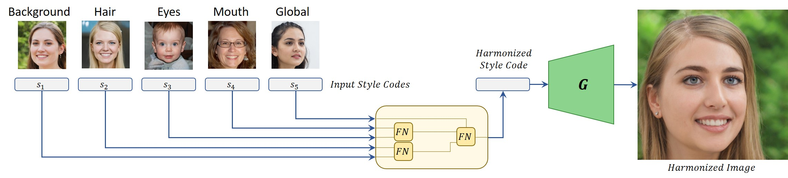

# StyleFusion: A Generative Model for Disentangling Spatial Segments



> **StyleFusion: A Generative Model for Disentangling Spatial Segments**<br>
> Omer Kafri, Or Patashnik, Yuval Alaluf, Daniel Cohen-Or <br>
> https://arxiv.org/abs/2107.07437 <br>
>
>**Abstract:** We present StyleFusion, a new mapping architecture for StyleGAN, which takes as input a number of latent codes and fuses them into a single style code. Inserting the resulting style code into a pre-trained StyleGAN generator results in a single harmonized image in which each semantic region is controlled by one of the input latent codes. Effectively, StyleFusion yields a disentangled representation of the image, providing fine-grained control over each region of the generated image. Moreover, to help facilitate global control over the generated image, a special input latent code is incorporated into the fused representation. StyleFusion operates in a hierarchical manner, where each level is tasked with learning to disentangle a pair of image regions (e.g., the car body and wheels). The resulting learned disentanglement allows one to modify both local, fine-grained semantics (e.g., facial features) as well as more global features (e.g., pose and background), providing improved flexibility in the synthesis process. As a natural extension, StyleFusion enables one to perform semantically-aware cross-image mixing of regions that are not necessarily aligned. Finally, we demonstrate how StyleFusion can be paired with existing editing techniques to more faithfully constrain the edit to the user's region of interest.

## Citation

If you use this code for your research, please cite our paper:

```
@misc{kafri2021stylefusion,
      title={StyleFusion: A Generative Model for Disentangling Spatial Segments}, 
      author={Omer Kafri and Or Patashnik and Yuval Alaluf and Daniel Cohen-Or},
      year={2021},
      eprint={2107.07437},
      archivePrefix={arXiv},
      primaryClass={cs.CV}
}
```
